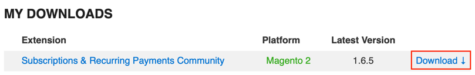

# Altapay for Magento2 Recurring Payments

Altapay has made it much easier for you as merchant/developer to receive secure subscription/recurring payments in your Magento2.3.x web shop.

## Dependencies

### Download amasty packages

- Go to https://amasty.com/subscriptions-recurring-payments-for-magento-2.html
- Purchase the plugin, or login to your account if you already purchased a copy
- Go to https://amasty.com/extupdates/account/downloads/
- Click on Download

- `mkdir -p vendor`
- `cp -r ~/Downloads/SubscriptionsRecurringPaymentsforMagento2-1/upload/app/code/Amasty vendor`

## Changelog

See [Changelog](CHANGELOG.md) for all the release notes.

## License

Distributed under the MIT License. See [LICENSE](LICENSE) for more information.

## Documentation

For more details please see [AltaPay docs](https://documentation.altapay.com/)

## Contact
Feel free to contact our support team (support@altapay.com) if you need any assistance.